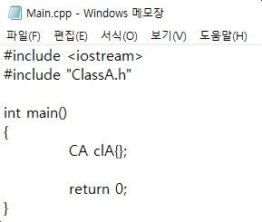
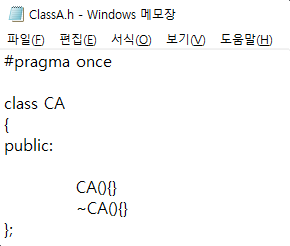

# 1. Table of contents
[1. Definition](#1-Definition)  
[2. Explanation](#2-Explanation)
## 1. Definition
- ["In computing, source code, or simply code, is any collection of text, with or without comments, written using a human-readable programming language, usually as plain text." (Source Code, Wikipedia)](https://en.wikipedia.org/wiki/Source_code)
## 2. Explanation
- Basically, code refers to **text** which is written using a human-readable programming language. Therefore, cpp or header file in C++ are nothing more than a text file. Below are cpp and header files opened with Notepad. Encoding is [UTF-8](https://en.wikipedia.org/wiki/UTF-8).

|||
|---|---|
|Main.cpp|ClassA.h|
